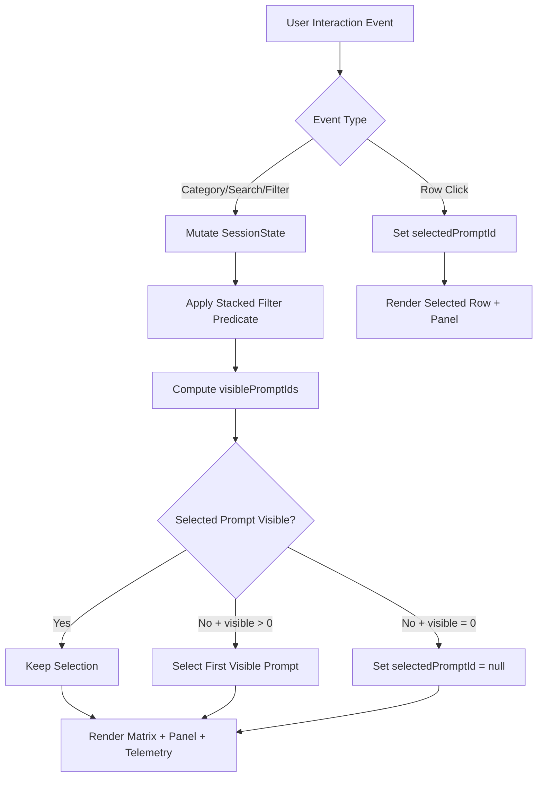
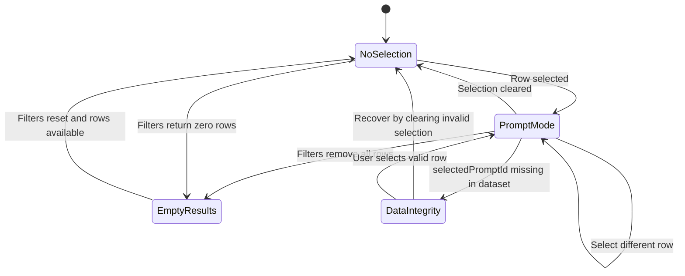
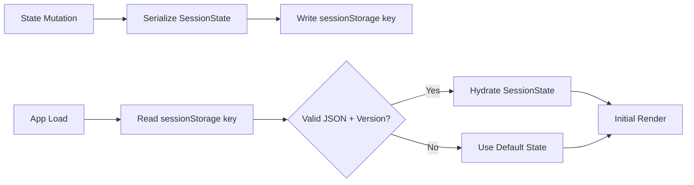

# PHASE 3 — Prompt Execution System Interaction Logic

## Scope

This document defines runtime behavior for the Prompt Execution System UI:

1. Category filtering  
2. Multi-filter stacking  
3. Search indexing  
4. Row selection  
5. Detail panel rendering

The system is command-interface oriented: interaction latency is prioritized over visual transitions.

---

## 1) Runtime Logic Architecture

### Processing Principle

- All filtering and selection logic runs client-side in memory.
- No route changes and no page reloads are used.
- All updates are event-driven and render in the same frame cycle.

### Data Flow Layers

1. **Source Layer**: canonical prompt dataset (`PromptRecord[]`)
2. **Index Layer**: precomputed searchable text index (`Map<promptId, SearchBlob>`)
3. **State Layer**: session state object (`SessionState`)
4. **Projection Layer**: derived visible matrix rows (`VisibleRows`)
5. **View Layer**: matrix + right detail panel + telemetry counters

---

## 2) State Model

```ts
type PromptId = string;
type CategoryId = string;

type SessionState = {
  // user-intent state
  activeCategory: CategoryId | null;      // null means ALL categories
  filters: {
    search: string;                       // normalized lowercase text
    department: string[];                 // multi-select
    npdStage: string[];                   // multi-select
    complexity: string[];                 // e.g., ["L1","L2","L3","L4"]
    value: string[];                      // e.g., ["Low","Medium","High","Critical"]
    confidence: string[];                 // e.g., ["Low","Medium","High"]
  };
  sort: {
    column: "value" | "confidence" | "time" | "complexity" | "title";
    direction: "asc" | "desc";
  };
  selectedPromptId: PromptId | null;

  // derived/session metadata
  visiblePromptIds: PromptId[];
  lastInteractionAt: number;              // epoch ms
  indexVersion: number;
};
```

### Persistence Contract (Session-Scoped)

- Persist key: `imi.promptExecution.sessionState.v1`
- Storage: `sessionStorage`
- Save trigger: after any state mutation event
- Restore timing: app bootstrap before first render
- Fallback behavior:
  - If parse fails or version mismatch: reset to default state
  - If key unavailable (restricted browser mode): keep in-memory only

---

## 3) Search Indexing Model

### Indexed Fields

Each prompt record is flattened into a normalized token blob:

- `title`
- `category`
- `department`
- `npdStage`
- `useCase`
- `outputType`
- `purpose`
- `promptTemplate`
- `variables[].name`
- `expectedOutput`
- `failureModes[]`
- `followUpPrompts[]`

### Index Build Strategy

- Build once at app initialization.
- Normalize by:
  - lowercasing
  - trim whitespace
  - collapse repeated spaces
  - optional punctuation stripping for robust matching
- Store as:

```ts
Map<PromptId, string> // searchable blob per prompt
```

### Search Execution

- Instant substring matching over indexed blob.
- Multi-token search uses AND semantics:
  - query `"cost risk"` means prompt blob must include both tokens.

---

## 4) Core Filtering Behavior

## 4.1 Category Filtering

Behavior:
- Clicking a category card sets `activeCategory`.
- Clicking the active category again toggles back to `null` (ALL).
- Category filter is applied before matrix render and combines with all other filters.

Rule:
- Category is not exclusive against other filters; it is part of the same filter predicate chain.

## 4.2 Multi-Filter Stacking

Stacking logic is conjunctive:

```text
visible = byCategory
      AND byDepartment
      AND byNpdStage
      AND byComplexity
      AND byValue
      AND byConfidence
      AND bySearch
```

For each filter dimension:
- empty selection = pass-through (no restriction)
- non-empty selection = include rows matching any selected option in that dimension

This yields **OR within a dimension, AND across dimensions**.

---

## 5) Row Selection and Detail Panel Behavior

## 5.1 Row Selection

- Click matrix row -> `selectedPromptId = row.promptId`
- Selected row gets active styling in matrix.
- If selected row is filtered out by a later filter change:
  - auto-select first visible row
  - if no rows remain, set `selectedPromptId = null`

## 5.2 Detail Panel Rendering

Panel render modes:

1. **Prompt Mode**: selected prompt exists and is visible  
2. **No-Selection Mode**: visible rows > 0 and no selected prompt  
3. **Empty-Results Mode**: visible rows = 0  
4. **Data-Integrity Mode**: selected prompt ID missing from dataset

Fallback rules for missing prompt fields:

- Missing tags -> show `[]`
- Missing purpose -> show `"No purpose provided."`
- Missing prompt template -> show `"Template unavailable."`
- Missing variables -> show `"No variables defined."`
- Missing expected output -> show `"No expected output schema provided."`
- Missing coaching notes / failure modes / follow-up -> show section placeholder text

---

## 6) Edge Case Handling

### A) Empty Results

Condition:
- `visiblePromptIds.length === 0`

System response:
- Matrix shows zero-state row: `"No prompts match current filters."`
- Panel switches to Empty-Results Mode with:
  - active filter summary
  - `Clear Filters` action (resets all filters, keeps category optional)

### B) Missing Data

Condition:
- prompt field undefined/null

System response:
- Render field-level placeholders (never crash render)
- Exclude missing fields from tokenization safely
- Log soft warning in dev mode only

### C) Conflicting Filters

Condition:
- valid filters produce empty intersection

System response:
- same handling as Empty Results
- show conflict hint: `"Current filter combination yields no intersecting prompts."`

---

## 7) Event Handling Specification

| Event | Source | State Mutation | Derived Recompute | UI Updates |
|---|---|---|---|---|
| `APP_INIT` | bootstrap | restore state/defaults | build index + compute visible rows | render header/cards/filters/matrix/panel |
| `CATEGORY_CLICK` | category card | set/toggle `activeCategory` | recompute visible + selection validity | update card active state, matrix, panel, telemetry |
| `SEARCH_INPUT` | search box (`input`) | set `filters.search` | recompute visible + selection validity | update matrix count, rows, panel |
| `FILTER_CHANGE` | any dropdown/multi-select | update relevant filter array | recompute visible + selection validity | update matrix + telemetry + panel |
| `SORT_CHANGE` | matrix header | update `sort` | re-sort visible rows | rerender matrix only (panel unchanged unless selected row position changes) |
| `ROW_CLICK` | matrix row | set `selectedPromptId` | none (or verify exists) | update row active style + panel content |
| `CLEAR_FILTERS` | zero-state CTA / filter strip | reset all filters and search | recompute visible + revalidate selection | full matrix/panel refresh |
| `SESSION_SAVE` | post-mutation hook | persist snapshot | none | no visible UI change |
| `DATA_REFRESH` | optional live data update | dataset replacement | rebuild index + recompute | full rerender with selection reconciliation |

---

## 8) Logic Flow Diagrams

## 8.1 Filter + Selection Flow



## 8.2 Detail Panel Render State Machine



## 8.3 Session Persistence Flow



---

## 9) Performance and Responsiveness Rules

- Target filter response: in-frame update on ordinary dataset sizes.
- Debounce not required for search at moderate scale; if dataset scales significantly, apply 50–100 ms debounce for input events only.
- Avoid full DOM rebuild where possible:
  - matrix rows use keyed render
  - panel rerender only when `selectedPromptId` or selected record data changes

---

## 10) Implementation-Ready Pseudocode

```ts
function onFilterMutation(mutator: (s: SessionState) => void) {
  mutator(state);
  state.lastInteractionAt = Date.now();

  state.visiblePromptIds = computeVisiblePromptIds(data, index, state);
  reconcileSelection(state);

  renderCategoryCards(state);
  renderFilterStrip(state);
  renderMatrix(state, data);
  renderDetailPanel(state, data);
  renderTelemetry(state, data);

  persistSessionState(state);
}

function reconcileSelection(state: SessionState) {
  if (state.visiblePromptIds.length === 0) {
    state.selectedPromptId = null;
    return;
  }

  if (!state.selectedPromptId || !state.visiblePromptIds.includes(state.selectedPromptId)) {
    state.selectedPromptId = state.visiblePromptIds[0];
  }
}
```

---

## Deliverable Completeness Checklist

- [x] Category filtering defined  
- [x] Multi-filter stacking defined  
- [x] Search indexing defined  
- [x] Row selection defined  
- [x] Panel rendering defined  
- [x] Instant/no-reload behavior defined  
- [x] Session persistence defined  
- [x] Empty/missing/conflict edge cases defined  
- [x] Logic flow diagrams included  
- [x] State model included  
- [x] Event handling included
